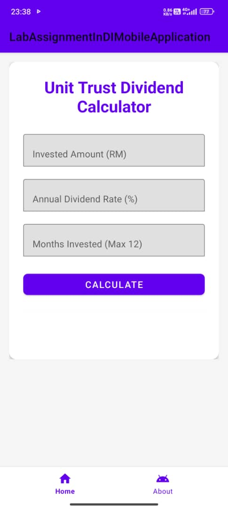
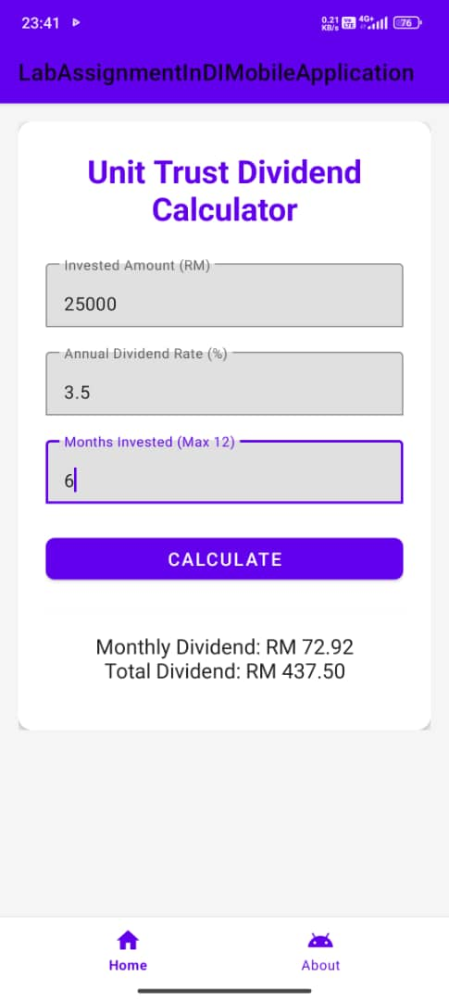

# Unit Trust Dividend Calculator

## Description
A mobile Android application that calculates dividends from unit trust investments based on invested amount, annual dividend rate, and investment duration.

## Features
- Calculate monthly and total dividends
- Responsive UI with intuitive design
- Input validation and formatted output

## Usage
1. Enter the invested amount in RM
2. Enter the annual dividend rate in percentage
3. Enter the number of months to invest
4. Click Calculate to see monthly and total dividends
5. Navigate to About page for app information

## Built With
- Android Studio (Java + XML)

### 📦 Download APK
- [unit_trust_dividend.apk](https://github.com/Najwan22/lab-assignment-indi-mobile-application/releases/download/v1.0.0/unit_trust_dividend.apk)

## 📺 Demo Video

## 📄 Screenshots
### 🏠 Home Screen

### 📊 Result

### ℹ️ About Page

